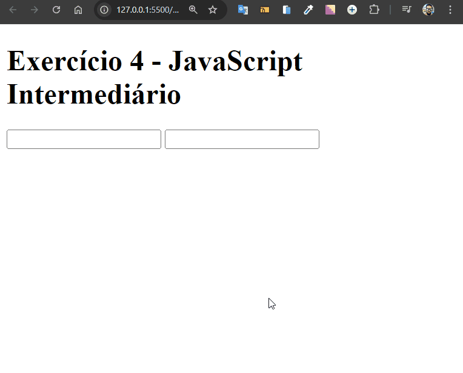

# Validação de Preenchimento de Input

Desenvolvido como exercício de JavaScript intermediário do curso de extensão universitária do DevQuest - Dev em Dobro.

Este projeto é um exercício prático que demonstra como validar o preenchimento de campos de input em um formulário usando JavaScript. Ele foca em demonstrar que o campo está ativo, ou seja, recebendo digitação.



## Tecnologias Utilizadas

- **HTML**
- **CSS**
- **JavaScript**

## Como Usar

1. Clone o repositório:

   ```bash
   git clone https://github.com/Alberesbass/validacao-de-preenchimento-de-input.git
   ```

2. Abra o arquivo `index.html` no navegador e preencha o formulário para ver a validação em ação.

## Licença

Este projeto está sob a licença MIT. Consulte o arquivo [LICENSE](./LICENSE) para mais informações.

---

Desenvolvido por [Alberes](https://github.com/Alberesbass)

---